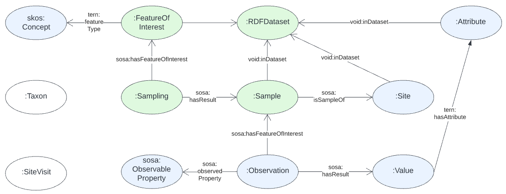
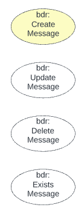

= BDR Gateway Test Client

This is a small Python program made to test the http://bdrgateway.surroundaustralia.com[BDR Gateway] API which is used to absorb data into the _Biodiversity Data Repository_ being built for the https://www.awe.gov.au[Department of Agriculture, Water and the Environment].

This tool synthesis data that emulates the kind of messages likely to be sent to the BDR. The messages conform to the https://surroundaustralia.github.io/abis/specification.html[ABIS Specification] although we also expect to test messages that deliberately don't conform. The majority of the messages' content conforms to the https://linkeddata.tern.org.au/information-models/tern-ontology[TERN Ontology] so it mainly consists of `Sampling`, `Sample`, `Site`, `Observation` and `Dataset` objects.

== Data

The data able to be generated by this Test Client covers a proportion of all the data that the BDR may received via messaged. Ideally 100%, the state of coverage is given in the figures in the next section.

=== Data element coverage

.Test Coverage element key
image::images/key.png[]

.TERN Ontology Coverage

.BDRM Ontology Coverage

==== ABIS Data Management Ontology

== Use

* **`synth.py`** - synthesizes data. Takes a single command line arg of a number > 1, < 10,000 for the no. of Samplings
* `validate_egs.py` - attempts to validate each example message file using all the validators combined
* `validate_egs_rdf.py` - just checks each example is valid RDF
** useful if new problematic example files need testing as at least syntactically before full use in validation tests

