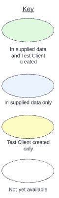
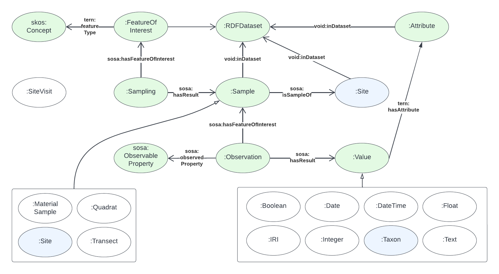
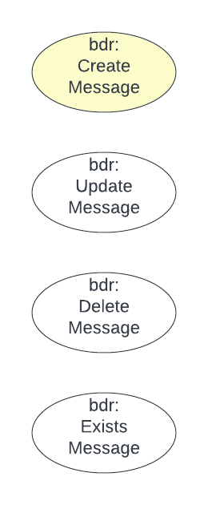
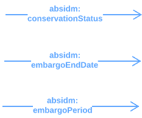

= BDR Gateway Test Client

This is a small Python program made to test the http://bdrgateway.surroundaustralia.com[BDR Gateway] API which is used to absorb data into the _Biodiversity Data Repository_ being built for the https://www.awe.gov.au[Department of Agriculture, Water and the Environment].

This tool creates synthetic data that emulates the kind of messages likely to be sent to the BDR. The messages conform to the https://surroundaustralia.github.io/abis/specification.html[ABIS Specification] although we also expect to test messages that deliberately don't conform. The majority of the messages' content conforms to the https://linkeddata.tern.org.au/information-models/tern-ontology[TERN Ontology] so it mainly consists of `Sampling`, `Sample`, `Site`, `Observation` and `Dataset` objects.

== Data

The data able to be generated by this Test Client covers a proportion of all the data that the BDR may receive via messages. While coverage is ideally 100%, the actual state of coverage is given in the figures in the next section.

=== Data element coverage

.Test Coverage element key

.TERN Ontology Coverage

.BDRM Ontology Coverage

.ABIS-DM Ontology Coverage

== Use

The `__main__.py` file within the `client/` module is the entry point for this program and can be run from the command line, within the main directory of this repository when cloned locally, as follows:

~$ python client {SCENARIO} {N}

where:

* {SCENARIO} is the fixed bounding area (broad, degree, narrow) of the data
* {N} is the number of Samplings to make within the scenario's area

This will print data to standard out, so you may wish to redirect it to a file as follows:

~$ python client 25 broad > my_file.ttl

`my_file.ttl` will be a Turtle file with your result.

=== Other configuration

The main script doing all the work is `client/synthesizer_tern.py`. `__main__.py` just calls that script to create a `TernSynthesizer` object on which `to_graph()` is then called to make a result.

For ABIS Data Management ontology additions to TERN output, see the `client/synthesizer_abis.py` file.

For BDR message wrapping of TERN or ABIS outputs, see the `client/synthesizer_bdr.py` file _(not implemented yet)_.

== Example outputs

See the _scenario_*.ttl_ files in this repo.

== License & Copyright

The license for this code is the https://opensource.org/licenses/BSD-3-Clause[BSD 3-Clase License], see the LICENSE file in this repo for the deed.

&copy; SURROUND Australia Pty Ltd, 2022

== Contact

*Nicholas J. Car* +
_Lead code author_ +
Data Systems Architect +
https://surroundaustralia.com[SURROUND Australia Pty Ltd.]
nicholas.car@surroundaustralia.com

